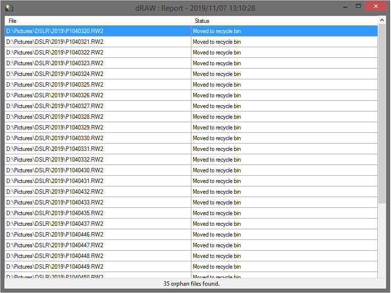

# dRAW

## About
Easily search and remove orphan RAW files that don't have corresponding / matching JPG in same directory, and vice versa.




:warning: Use at your own risk.

## Usage
1. Download [latest release](https://github.com/FoxP/dRAW/releases/latest)
	- Portable version : [dRAW_portable.zip](https://github.com/FoxP/dRAW/releases/latest/download/dRAW_portable.zip)
	- Setup installer : [dRAW_setup.msi](https://github.com/FoxP/dRAW/releases/latest/download/dRAW_setup.msi)
2. Select :
	- file formats (depends on your camera brand)
	- actions to perform (delete, recycle bin, archive)
	- Input directory (with / without recursivity inside)
3. `Dry-run` to preview the result
4. `Apply` to delete / move orphan files

## Features
- Delete / move to recycle bin / archive :
  - RAW files with missing JPG
    - ...and vice versa
  - If paired / matching file exists
	- ...or not
- Search recursively (or not) inside a directory
- `Dry-run` mode before deleting / moving files
- Report / log for each deleted / moved file
- Fully portable, no rights / setup needed
- No administrator rights needed
- Free, copyleft license

## Supported file formats :
  - 3FR (Hasselblad)
  - ARI (Arri_Alexa)
  - ARW (Sony)
  - BAY (Casio)
  - BRAW (Blackmagic Design)
  - BMP (Windows bitmap)
  - CAP (Phase One)
  - CR2 (Canon)
  - CR3 (Canon)
  - CRI (Cintel)
  - CRW (Canon)
  - DC2 (Kodak)
  - DCR (Kodak)
  - DCS (Kodak)
  - DNG (Generic)
  - DRF (Kodak)
  - EIP (Phase One)
  - ERF (Epson)
  - FFF (Imacon, Hasselblad)
  - GIF (Graphics Interchange Format)
  - GPR (GoPro)
  - IIQ (Phase One)
  - JPG (Joint Photographic Experts Group)
  - JPEG (Joint Photographic Experts Group)
  - K25 (Kodak)
  - KC2 (Kodak)
  - KDC (Kodak)
  - MDC (Minolta, Agfa)
  - MEF (Mamiya)
  - MOS (Leaf)
  - MRW (Minolta)
  - NEF (Nikon)
  - NRW (Nikon)
  - ORF (Olympus)
  - PDF (Portable Document Format)
  - PEF (Pentax, Samsung)
  - PNG (Portable Network Graphics)
  - PSD (Adobe PhotoShop Document)
  - PTX (Pentax)
  - PXN (Logitech)
  - QTK (Apple)
  - R3D (RED Digital Cinema)
  - RAF (Fuji)
  - RAW (Generic)
  - RDC (Rollei)
  - RW2 (Panasonic)
  - RWL (Leica)
  - RWZ (Rawzor)
  - SR2 (Sony)
  - SRF (Sony)
  - SRW (Samsung)
  - STI (Sinar)
  - TIF (Tagged Image File Format)
  - TIFF (Tagged Image File Format)
  - X3F (Sigma)

## Advanced
To add more supported file formats :
1. Edit `dRAW.exe.config` file :

```xml
...
<setting name="FileFormats" serializeAs="Xml">
	<value>
		<ArrayOfString xmlns:xsi="http://www.w3.org/2001/XMLSchema-instance"
			xmlns:xsd="http://www.w3.org/2001/XMLSchema">
			<string>CR2 (Canon)</string>
			<string>CR3 (Canon)</string>
			<string>CRW (Canon)</string>
			<string>DNG (Generic)</string>
			<string>RAW (Generic)</string>
			<string>RW2 (Panasonic)</string>
			<string>NEF (Nikon)</string>
			<string>NRW (Nikon)</string>
			...
			<string>YOUR ADDITIONAL FILE EXTENSION GOES HERE</string>
			...
		</ArrayOfString>
	</value>
</setting>
...
```

2. Save, restart `dRAW`, and enjoy
3. Create a pull request :wink:

## Requirements
- Microsoft [.NET Framework 4](https://www.microsoft.com/en-US/download/details.aspx?id=17851)
- Microsoft Windows Vista or later

## Todo
- Localization
- Multi-threading
- More supported file formats

## Libraries
- Camera emoji :camera: from [Twemoji](https://github.com/twitter/twemoji)

## License
dRAW is released under the [GNU General Public License v3.0](https://www.gnu.org/licenses/gpl-3.0.fr.html).
